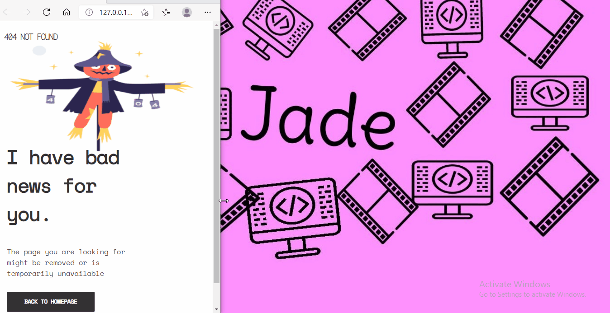

# 404-not-found
This is the solution to the beginner challenge on devchallenges.io. The task is to design a "404 not found" page

<!-- Please update value in the {}  -->

<h1 align="center">{Your project name}</h1>

   Solution for a challenge from  <a href="http://devchallenges.io" target="_blank">Devchallenges.io</a>.

  <h3>
    <a href="https://404jade.netlify.app/">
      Demo
    </a>
     | 
    <a href=" https://github.com/jadesola123/404-not-found">
      Solution
    </a>
     | 
    <a href="https://devchallenges.io/challenges/wBunSb7FPrIepJZAg0sY">
      Challenge
    </a>
  </h3>

<!-- TABLE OF CONTENTS -->

## Table of Contents

- [Overview](#overview)
  - [Built With](#built-with)
- [Features](#features)
- [Contact](#contact)
- [Acknowledgements](#acknowledgements)

<!-- OVERVIEW -->

## Overview

- Where can I see your demo?
[Here](https://404jade.netlify.app/)
- What was your experience?
It was pretty straightforward and esy, the figma design made the css part esier, if anything was challenging, it was making the site as responsive as possible.
- What have you learned/improved?
I've definitely improved in my CSS for sure

### Built With

<!-- This section should list any major frameworks that you built your project using. Here are a few examples.-->

- [HTML](https://www.learn-html.org/)
- [CSS](https://css-tricks.com/)

## Features

<!-- List the features of your application or follow the template. Don't share the figma file here :) -->

This application/site was created as a submission to a [DevChallenges](https://devchallenges.io/challenges) challenge. The [challenge](https://devchallenges.io/challenges/wBunSb7FPrIepJZAg0sY) was to build an application to complete the given user stories.

## Acknowledgements

<!-- This section should list any articles or add-ons/plugins that helps you to complete the project. This is optional but it will help you in the future. For exmpale -->

- [Steps to replicate a design with only HTML and CSS](https://devchallenges-blogs.web.app/how-to-replicate-design/)
- [Marked - a markdown parser](https://github.com/chjj/marked)

## Contact

- Website | [jadekareem.hashnode.dev](https://jadekareem.hashnode.dev)
- GitHub | [@jadesola123](https://github.com/jadesola123)
- Twitter | [@jadecodes](https://twitter.com/jadecodes)
 